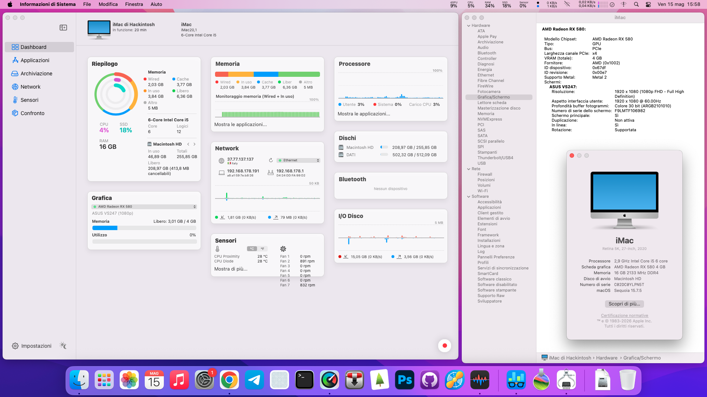
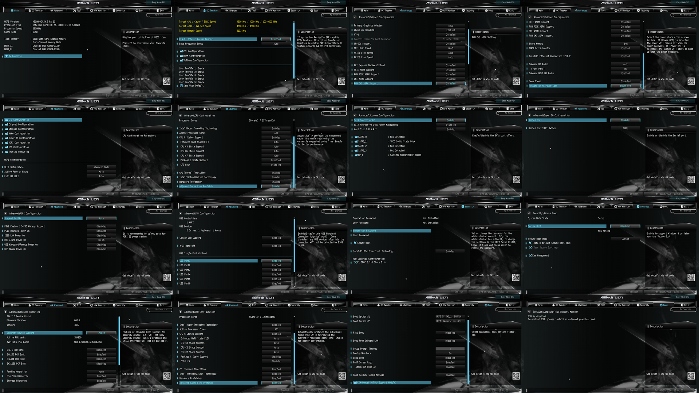
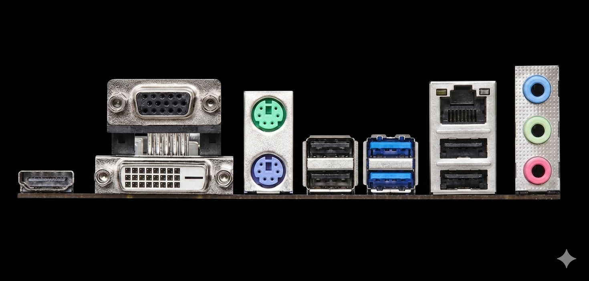
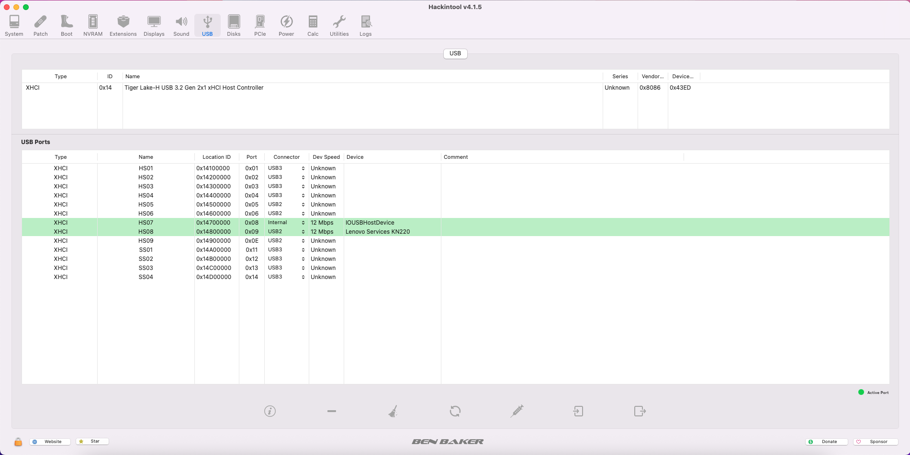
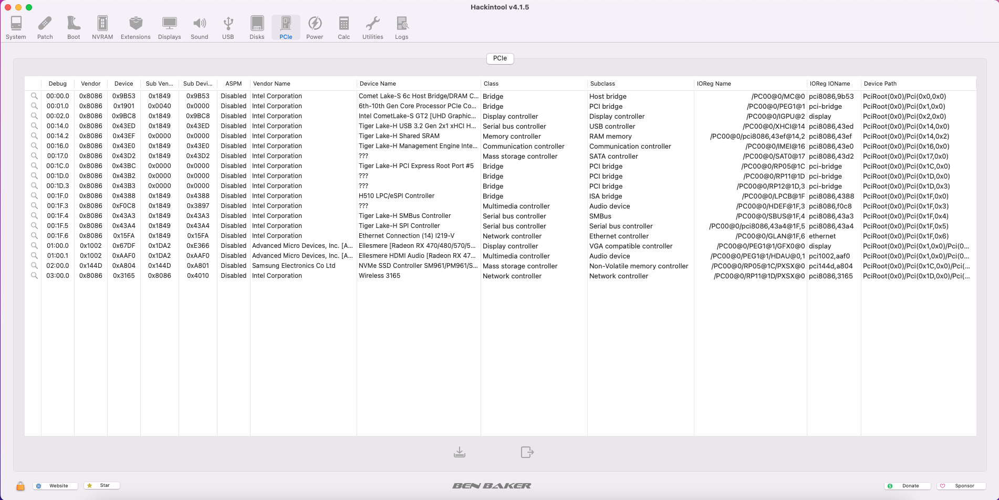
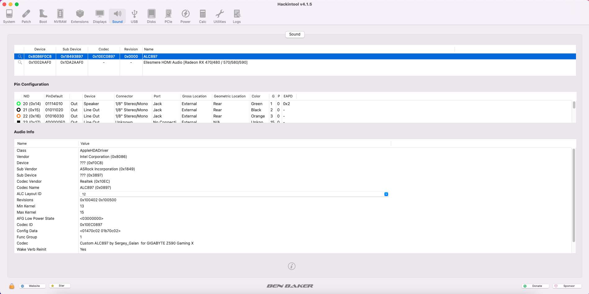
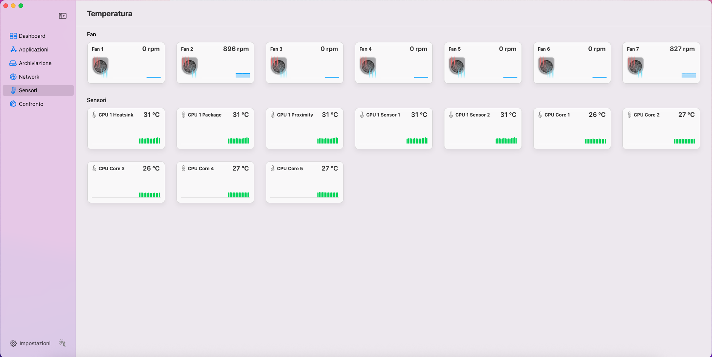
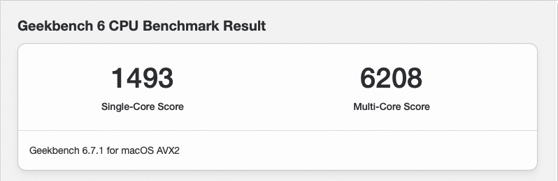
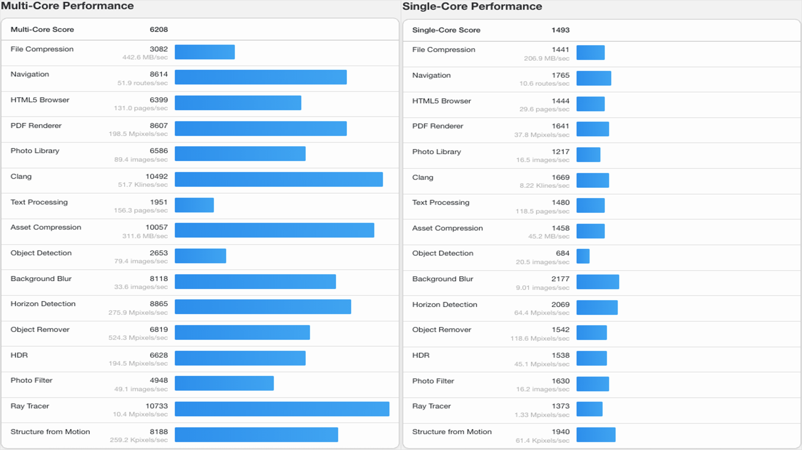
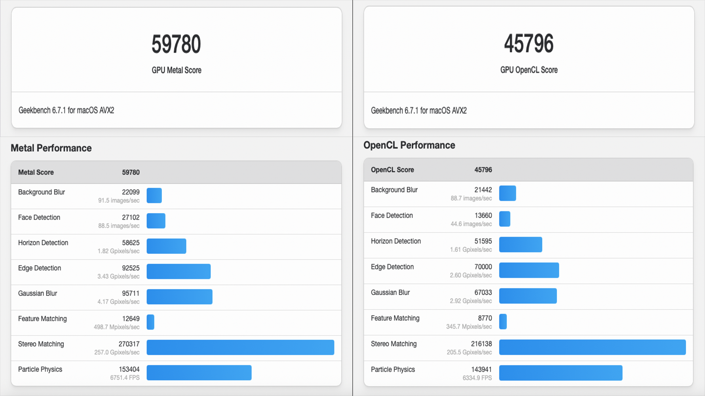

# Hackintosh Asrock H510m HDV\M2
Full Hackintosh with i5 10400 + RX 580

## repository no longer update

## EFI Asrock H510m HDV\M2 + Intel WiFi(ac) + I5 10400 + 16g DDR4(crucial) + RX 580 4g

with OpenCore bootloader

### Computer Spec & Info:

| Component                       | Brank                          |What works and What doesn't            |
| ----------------------------|------------------------------------|---------------------------------------|
| CPU                         | Intel i5 10400 (6C-12T)            |[x] CFG Unlock                         |
| iGPU                        | Intel® Graphics UHD 630            |[x] Graphics UHD 630 (task only)       |
| Audio                       | Realtek ALC897 7.1                 |[x] GPU Sapphire RX 580 4g             |
| Ram                         | 16 GB DDR4 2133 Mhz                |[x] ALC897 All jack activate           |
| Wifi + Bluetooth            | Intel CNVi interface ac (3165NGW)  |[x] ALC1220 Combo jack external        |
| Lan                         | Intel I219-V GbE Lan               |[x] All USB-A 3.1 Ports                |
| NVMe                        | Samsung 256g  (Mac OS).            |[x] SpeedStep/Sleep/Wake               |
| SSD                         | SPCC Silicon Power 512G (DATI).    |[x] Wi-Fi and BT Intel - HeliPort/itlwm|
| SmBios                      | iMac 20,1                          |[x] All Sensors CPU,GPU,NVME,SATA,FAN  |
| BootLoader                  | OpenCore 1.0.7                     |[x] NVRAM                              |
| macOS                       | Sequoia 15.7.5                     |[x] Recovery (macOS) boot from OpenCore|

### Bios Setup:

NB: con schede video AMD il CSM deve essere su Disable per tutte le marche di schede madri

## Perimetral

       

##Performance Benchmark

# If you need help please contact us on [Telegram](https://t.me/HackintoshLife_it) or [Web](https://www.hackintoshlife.it/)
