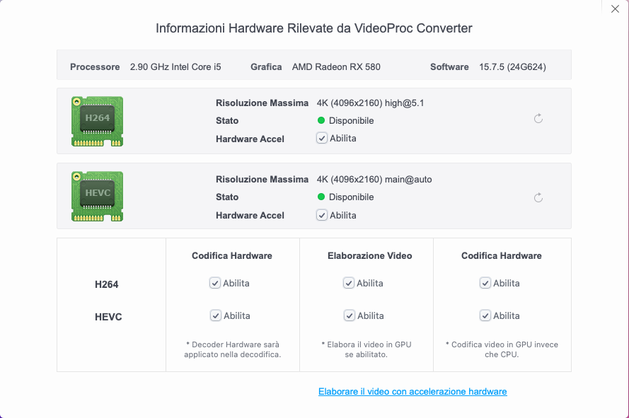

# Hackintosh Asrock H510m HDV\M2
Full Hackintosh with i5 10400 + RX 580

## repository no longer update

## EFI Asrock H510m HDV\M2 + Intel WiFi(ac) + I5 10400 + 16g DDR4(crucial) + RX 580 4g

with OpenCore bootloader

### Computer Spec & Info:

| Component                       | Brank                          |What works and What doesn't            |
| ----------------------------|------------------------------------|---------------------------------------|
| CPU                         | Intel i5 10400 (6C-12T)            |[x] CFG Unlock                         |
| iGPU                        | Intel® Graphics UHD 630            |[x] Graphics UHD 630 (task only)       |
| Audio                       | Realtek ALC897 7.1                 |[x] GPU Sapphire RX 580 4g             |
| Ram                         | 16 GB DDR4 2133 Mhz                |[x] ALC897 All jack activate           |
| Wifi + Bluetooth            | Intel CNVi interface ac (3165NGW)  |[x] ALC1220 Combo jack external        |
| Lan                         | Intel I219-V GbE Lan               |[x] All USB-A 3.1 Ports                |
| NVMe                        | Samsung 256g  (Mac OS).            |[x] SpeedStep/Sleep/Wake               |
| SSD                         | SPCC Silicon Power 512G (DATI).    |[x] Wi-Fi and BT Intel - HeliPort/itlwm|
| SmBios                      | iMac 20,1                          |[x] All Sensors CPU,GPU,NVME,SATA,FAN  |
| BootLoader                  | OpenCore 1.0.7                     |[x] NVRAM                              |
| macOS                       | Sequoia 15.7.5                     |[x] Recovery (macOS) boot from OpenCore|

### Bios Setup:

## Trik Mic Fix
* USB Dongle Mic:
At the moment there is no fix for the internal microphone and combojack microphone, as both are managed by the SST (Smart Sound Technology Intel) drive.
I use a USB dongle and it works perfectly.

       

## All Apple native shortcuts for sleep, log out and Shut Down

##Performance Sleep

## CPU Performance by CPU Friend settings

See [CPUFriend](https://github.com/acidanthera/CPUFriend) For more info 

## Peripherals & TouchPad Setting & Benchmarks

### Special Config:/Users/mario/Desktop/image

- Usb port mapping performed
- SSDT-Hack Essential patch
- Applied cosmetics PCI Dev

See [ioreg](https://github.com/Speeedo83/Dell-Inspiron-5491-2in1-Hakintosh/raw/main/ioregMacBookPro.zip) for more clarification

### MacOS bootable USB creation:
- Read the Dortania guide for creating your USB from Windows or macOS
- [Guide Dortania](https://dortania.github.io/OpenCore-Install-Guide/installer-guide/) - USB creation

## Bios settings
### Enable :
* SATA Operation : AHCI
* Fastboot : Thorough
* Integrated NIC : Enable

### Disable : 
* Secure Boot
* Absolute
* TPM2.0 Security On
* Intel SGX
* SMM Security Migration
* Wake on AC
* Wake on Dell USB-C Dock
* Power On Lid Open
* Enable UEFI Network Stack
* Sign Of Life : Early Logo Display / Early keyboard backlight
* cfg lock and DVMT: DO AT YOUR OWN RISK!!! It may brick your laptop.

## Guide

Create a usb in FAT with MBR map and put ru.efi in it then go to the bios, and create an entry with the path of the usb and setting the ru.efi file and the name of your choice startup and then send and finally click apply.
Restart and press f12 among the entries you will have the last created, click any key, then click alt + ì a menu will appear and scroll to CpuSetup and click enter, in the new screen go with the arrows on the value and change it from 01 to 00 and click enter and then ctrl + w to save and then alt + q to exit. proceed to check if your CFG LOCK is unlocked.

For the 2 DVMT values you have to go to the SaSetup menu and enter.
Look The picture and set:

save with ctrl + w and to exit alt + q and you will have the suitable DVMT values to the igpu

## Color profile icc with SpiderX Datacolor Pro (Standard ambient light) Screen brightness 80% 
See [calibrazione](https://github.com/Speeedo83/Dell-Inspiron-5491-2in1-Hakintosh/blob/main/Dell%20Inspire5491.icc)
 

## Credits

- [Apple](https://apple.com) for macOS.
- [Acidanthera](https://github.com/acidanthera) for OpenCore and all the lovely hackintosh work.
- [Dortania](https://dortania.github.io/OpenCore-Install-Guide/config-laptop.plist/icelake.html) For great and detailed guides.
- [Lorys89](https://github.com/Lorys89/) for making this hack perfect. 
- [Hackintoshlifeit](https://github.com/Hackintoshlifeit) Support group for installation and post installation.

# If you need help please contact us on [Telegram](https://t.me/HackintoshLife_it) or [Web](https://www.hackintoshlife.it/)
